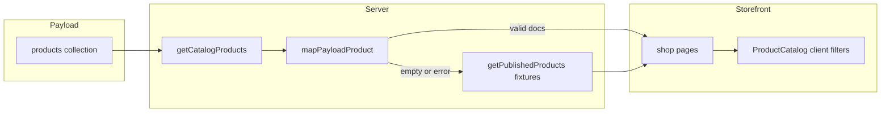

# Каталог и CMS

Связка между коллекцией Payload `products` и типом витрины `Product` (`src/domain/products.ts`).

## Поток данных

## `getCatalogProducts` (`src/lib/catalog.ts`)

- Кэш React `cache()` на запрос.
- `payload.find`: `published: true`, `saleStatus != hidden`, `limit: 100`, `depth: 1`.
- Каждый документ → `mapPayloadProduct`; `null` отбрасывается.
- **Если список CMS пуст** → фикстуры `getPublishedProducts()`.
- **При любой ошибке** (нет БД, нет секрета в dev и т.д.) → те же фикстуры.

Так витрина всегда открывается, даже без настроенной CMS.

## Маппинг полей

| CMS / документ | Домен `Product` | Fallback |
|----------------|-----------------|----------|
| `slug`, `title` | обязательны | — |
| `published`, `saleStatus` | скрытые не попадают в каталог | — |
| `price`, `salePrice` | целые рубли | фикстура по slug |
| `imageUrl` / relation `image` | `image.src`, `image.alt` | фикстура |
| `dropName`, `category`, descriptions | строки | фикстура |
| `productType` | `sized` \| `one_size` | фикстура |
| `sizes[]` | для sized | фикстура или отказ (null) |
| `stock` | для one_size | фикстура |
| `gallery` | пока из фикстуры | — |

Поле `imageTone` и заметка предзаказа также могут браться из фикстуры.

## Фильтры витрины (`domain/catalog.ts`)

Чистые функции без I/O:

- `getCatalogFacets(products)` — уникальные дропы и категории.
- `filterAndSortProducts(products, filters)` — поиск (ru-RU lower case), фильтр по дропу/категории, сортировки: `featured`, `price-asc`, `price-desc`, `title-asc`, `drop-asc`.

Клиент: `ProductCatalog.tsx` — query string или локальное состояние (смотреть реализацию компонента при доработке UX).

## Сид из фикстур

`npm run admin:seed` копирует `src/data/products.ts` в CMS поле-в-поле (`scripts/seed-admin.ts#productData`). После сида приоритет у CMS: витрина покажет CMS, пока есть хотя бы один валидный опубликованный товар.

## Инварианты в Payload

`src/payload/collections/Products.ts`:

- `beforeValidate` — целые цены/остатки, размеры для `sized`, stock для `one_size`.
- Access: публика read — `staffOrPublishedProduct` (гости видят только опубликованные не-hidden).

При добавлении поля:

1. Поле в коллекции Products.
2. Тип/поле в `Product` / `ProductBase`.
3. Фикстуры в `data/products.ts`.
4. Ветка в `mapPayloadProduct` и при необходимости в `productData()` сида.
5. Тесты домена или маппера, если меняется поведение фильтров/цен.

## Страницы, использующие каталог

- `/`, `/shop`, `/shop/[slug]`
- `/cart`, `/checkout` (актуальный список для sanitize корзины)
- `/blog/[slug]` (связанные товары)
- `sitemap.ts`

Блог/ивенты/основатель **не** используют `getCatalogProducts`.
