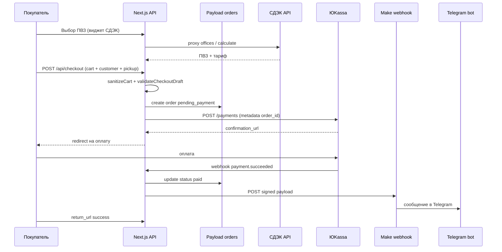

# Ресерч: СДЭК, ЮKassa, заказы в админке, webhook в Make

Дата: 2 июня 2026.

## Краткий вывод

Сейчас checkout — **UI-прототип**: два фиксированных ПВЗ, кнопка «Продолжить к оплате» показывает заглушку, **заказ в Payload не создаётся**, **ЮKassa не вызывается**.

Схема коллекции `orders` в CMS уже готова (статусы, СДЭК, позиции, `paymentId`). Для боевого сценария нужен **серверный checkout pipeline** из 4 частей:

1. **СДЭК Widget 3.0** — выбор ПВЗ и расчёт доставки на карте.
2. **POST `/api/checkout`** — валидация корзины + черновик → создание заказа `pending_payment` в Payload.
3. **ЮKassa** — создание платежа, redirect, webhook `payment.succeeded` → статус `paid`.
4. **Outbound webhook в Make** — после оплаты (или после создания заказа) отправка JSON в Make → сценарий → Telegram-бот.

---

## Текущее состояние в коде

| Область | Файлы | Статус |
|---------|-------|--------|
| Валидация checkout | `src/domain/checkout.ts`, `tests/domain/checkout.test.ts` | Готово (контакты + ПВЗ) |
| UI checkout | `src/components/CheckoutClient.tsx` | Заглушка: `prototypePickups`, placeholder ЮKassa |
| Корзина | `CartClient`, `domain/cart.ts`, `localStorage` | Только клиент; сервер должен пересчитать |
| Схема заказа | `src/payload/collections/Orders.ts` | Полная: items, cdek*, paymentId, статусы |
| Access на orders | `create: admins` | **Блокер**: с витрины напрямую создать нельзя |
| Env | `.env.example`: `YOOKASSA_*`, `CDEK_*` | Заглушки, не используются |

Критично: коллекция `orders` разрешает `create` только админам. Заказы с сайта нужно создавать через **Route Handler** с `getPayload({ config })` и `overrideAccess: true` после серверной валидации.

---

## Целевой flow (рекомендуемый)



### Статусы заказа

| Этап | `status` |
|------|----------|
| Создан, ждём оплату | `pending_payment` |
| Webhook успешной оплаты | `paid` → `processing` |
| Ошибка / отмена платежа | `payment_failed` |
| Передан в СДЭК | `ready_for_cdek` → `shipped` |

Инварианты из `Orders.beforeValidate` уже проверяют: `amount = itemsTotal + deliveryTotal`, целые рубли, RUB, минимум одна позиция.

---

## 1. СДЭК: модуль выбора адреса / ПВЗ

### Официальное решение

- **CDEK Widget 3.0** — [github.com/cdek-it/widget](https://github.com/cdek-it/widget)
- CDN: `@cdek-it/widget@3`
- Требует **прокси-сервис** (`service.php` в доке) для:
  - `offices` — список ПВЗ;
  - `calculate` — расчёт тарифов (`calculator/tarifflist`).

В PHP-референсе используются `CDEK_CLIENT_ID` / `CDEK_CLIENT_SECRET` и API:

- тест: `https://api.edu.cdek.ru/v2`
- прод: `https://api.cdek.ru/v2`

### Интеграция в Next.js (BIGSTEP)

**Не использовать PHP.** Перенести логику `service.php` в Route Handler:

```
POST /api/cdek/service
Body: { action: "offices" | "calculate", ...params }
```

Сервер:

1. OAuth token СДЭК (кэш в памяти / Redis на проде).
2. Проксирует запросы к API v2.
3. **Не отдаёт** `client_secret` на клиент.

**UI:**

- Клиентский компонент `CdekWidget.tsx` (`'use client'`).
- Подключить скрипт виджета (dynamic, только на `/checkout`).
- `onChoose(delivery, rate, address)` → маппинг в `CdekPickupPoint`:
  - `code` ← код ПВЗ;
  - `name`, `address`, `city`;
  - `price` ← из тарифа (копейки → целые рубли для домена).

**Карта:** виджет 3.x использует Яндекс.Карты — нужен `YANDEX_MAPS_API_KEY` (отдельная переменная, не в `.env.example`).

**MVP-упрощение (если виджет затянется):**

- API `deliverypoints` + свой список/карта без виджета;
- или список ПВЗ по городу из поля «Город» + ручной расчёт одного тарифа.

**Что сохранять в заказе:** поля уже есть — `cdekPickupCode`, `cdekPickupName`, `cdekPickupCity`, `cdekPickupAddress`, `deliveryTotal`. Опционально добавить JSON `cdekRaw` для отладки/отгрузки.

### Предусловия от бизнеса

- Договор со СДЭК, `account` / `secure_password` или client credentials в личном кабинете интегратора.
- Решить: только ПВЗ (`office`) или ещё «до двери» (`door`) — в MVP достаточно **только ПВЗ** (`deliveryMethod: cdek_pickup`).

---

## 2. ЮKassa: оплата

### Документация

- Обзор: [yookassa.ru/docs/support/payments/overview](https://yookassa.ru/docs/support/payments/overview)
- API v3: [yookassa.ru/developers/api](https://yookassa.ru/developers/api)
- Webhooks: [yookassa.ru/developers/using-api/webhooks](https://yookassa.ru/developers/using-api/webhooks)

### Рекомендуемый flow

1. После создания заказа в Payload — `POST https://api.yookassa.ru/v3/payments`:
   - `amount.value` — строка `"1234.00"` (заказ в рублях; домен хранит integer — конвертировать на границе);
   - `confirmation.type: "redirect"`, `return_url`;
   - `capture: true` (одностадийная оплата);
   - `metadata.order_id` / `metadata.order_number`;
   - заголовок **`Idempotence-Key`** (UUID на попытку оплаты).

2. Ответ → `confirmation.confirmation_url` → redirect пользователя.

3. **`POST /api/webhooks/yookassa`**:
   - проверка IP ЮKassa (whitelist) и/или повторный `GET /payments/{id}`;
   - обработка `payment.succeeded`, `payment.canceled`;
   - **идемпотентность** (не переводить `paid` дважды);
   - всегда отвечать **HTTP 200**, иначе ретраи 24 ч.

4. `return_url` — страница «Проверяем оплату…» с polling `GET /api/orders/{orderNumber}/status` или просто «Спасибо, мы свяжемся».

### Чеки 54-ФЗ

Для ИП/самозанятого часто нужен блок `receipt` в создании платежа (email/phone покупателя, позиции, НДС). **Уточнить у бухгалтерии** до продакшена. Поля заказа (`customerEmail`, items) уже подходят для формирования чека.

### Env

```
YOOKASSA_SHOP_ID=
YOOKASSA_SECRET_KEY=
YOOKASSA_RETURN_URL=https://bigstep.ru/checkout/success
```

Секреты только на сервере; в клиент не попадают.

### SDK (опционально)

Можно без SDK — `fetch` + Basic Auth. TypeScript SDK: `@webzaytsev/yookassa-ts-sdk`, `yookassa-api-sdk` — для типов и idempotency.

---

## 3. Заказы в админке: что проверить

### Что реализовать

**`POST /api/checkout`** (рабочее имя):

**Вход:** `{ cart: CartItem[], customer, cdekPickup }`

**Сервер:**

1. `getCatalogProducts()` — актуальный каталог.
2. `sanitizeCart(cart, products)` — как в `CartClient`.
3. `validateCheckoutDraft(...)`.
4. Сгенерировать `orderNumber` (например `BS-20260602-0001`).
5. Собрать `items[]` с `relationship` на `products` (find by slug).
6. `payload.create({ collection: 'orders', overrideAccess: true, data })`.
7. Создать платеж ЮKassa, записать `paymentId`, вернуть `{ paymentUrl, orderNumber }`.

**Проверка в админке:**

- `/admin/collections/orders` — новый документ после тестового checkout.
- Колонки: `orderNumber`, `status`, `customerName`, `amount`.
- После webhook — `status: paid`, заполнен `paymentId`.

### Тест-план (ручной)

1. Товар в наличии → checkout → оплата тестовой картой ЮKassa (sandbox).
2. Заказ в админке со статусом `pending_payment`, затем `paid`.
3. Повторный webhook — статус не дублируется, Make не шлёт дважды (idempotency key).
4. Корзина с несуществующим slug — 400, заказ не создаётся.
5. Сумма на сайте = сумма в Payload = сумма в ЮKassa.

### Риски

| Риск | Митигация |
|------|-----------|
| Подмена цены с клиента | Все суммы считать на сервере из каталога |
| Race на остатках | После оплаты уменьшать stock (отдельная задача) или резерв |
| `create: admins` | Только server route + overrideAccess |
| Дубли webhook | Idempotency по `paymentId` |

---

## 4. API для Make → Telegram

### Паттерн (рекомендуемый)

**Исходящий webhook с сайта в Make**, не наоборот:

1. В Make: модуль **Webhooks → Custom webhook** → получить URL.
2. На сайте после `paid` (или `pending_payment`, если нужна отбивка «новый заказ»):

```
POST MAKE_ORDER_WEBHOOK_URL
Headers:
  Content-Type: application/json
  X-Bigstep-Signature: HMAC-SHA256(rawBody, MAKE_WEBHOOK_SECRET)
  X-Bigstep-Timestamp: unix
Body: { event, order, customer, items, cdek, payment }
```

3. Make: сценарий парсит JSON → **Telegram Bot → Send a message**.

### Альтернатива

- Make **HTTP module** опрашивает `GET /api/orders?status=paid&since=...` — хуже (задержка, секрет на polling).

### Payload для Make (черновик)

```json
{
  "event": "order.paid",
  "occurredAt": "2026-06-02T09:30:00Z",
  "order": {
    "orderNumber": "BS-20260602-0001",
    "status": "paid",
    "amount": 8550,
    "currency": "RUB",
    "deliveryTotal": 650,
    "paymentId": "22d6d597-000f-5000-9000-..."
  },
  "customer": {
    "fullName": "...",
    "phone": "...",
    "email": "...",
    "city": "..."
  },
  "cdek": {
    "code": "MSK123",
    "name": "...",
    "address": "..."
  },
  "items": [
    { "title": "ТЕСТ 00", "size": "M", "quantity": 1, "unitPrice": 7900 }
  ]
}
```

### Безопасность

- `MAKE_WEBHOOK_SECRET` ≥ 32 байт, только server env.
- HMAC по **raw body** + timestamp (окно 5 мин).
- В Make: фильтр по секрету или Custom function проверки (если нужно).
- Не логировать полный телефон/email в production logs.

### Env

```
MAKE_ORDER_WEBHOOK_URL=https://hook.eu1.make.com/...
MAKE_WEBHOOK_SECRET=
```

### События

| event | Когда | Решение |
|-------|-------|---------|
| `order.paid` | Webhook ЮKassa `payment.succeeded` | **Да** — единственная отбивка в Make |
| `order.created` | Заказ создан | Нет |
| `order.payment_failed` | Ошибка оплаты | Нет (только лог + статус в админке) |

---

## 5. Решения заказчика (зафиксировано)

| Вопрос | Решение |
|--------|---------|
| ЮKassa | **Самозанятый** — [приём для самозанятых](https://yookassa.ru/platezhi-dlya-samozanyatyh/); чеки через API уточнить при подключении магазина |
| СДЭК | **Только ПВЗ** (`office`), без «до двери»; `deliveryMethod: cdek_pickup` |
| Make | Отбивка **только `order.paid`** |
| Telegram | Простой бот; маршрутизация чатов — **на стороне Make** |
| Остатки | Списание **после успешной оплаты** (`payment.succeeded` → `paid`) |

### Остатки (детализация)

Списываем stock **один раз** — в обработчике webhook ЮKassa, когда заказ переходит в `paid`:

- `one_size` → уменьшить `products.stock`;
- `sized` → уменьшить `stock` у выбранного размера в массиве `sizes`.

До оплаты остатки **не трогаем** (заказ `pending_payment` не резервирует товар). Если понадобится защита от oversell при одновременных оплатах — отдельно добавить soft-reserve на `checkout` (не в scope сейчас).

При `payment_failed` / истечении срока оплаты — остатки не менялись, откат не нужен.

---

## 6. Предлагаемая структура файлов

```
src/
  app/api/
    checkout/route.ts          # create order + yookassa redirect
    webhooks/yookassa/route.ts
    cdek/service/route.ts      # proxy widget
    orders/[orderNumber]/route.ts  # status для success page (optional)
  lib/
    checkout/createOrder.ts    # Payload create + mapping
    payments/yookassa.ts       # create payment, verify webhook
    delivery/cdek.ts           # token, offices, calculate
    integrations/make.ts       # outbound webhook
  components/
    CdekWidget.tsx
```

Домен (`src/domain/*`) не трогать Payload/React — только расширить при новых полях.

---

## 7. Оценка этапов

| Этап | Содержание | Зависимости |
|------|------------|-------------|
| **0** | Договор СДЭК, магазин ЮKassa, ключи, Яндекс.Карты | Бизнес |
| **1** | `POST /api/checkout` + заказ в Payload (без оплаты) | — |
| **2** | СДЭК proxy + виджет на checkout | Ключи СДЭК |
| **3** | ЮKassa create + webhook + смена статуса | Shop ID + secret |
| **4** | Make outbound + TG сценарий | URL webhook Make |
| **5** | Success/fail страницы, e2e, **списание stock на paid** | 1–4 |

Ориентир по объёму кода: **1–2 недели** при наличии всех ключей и тестового магазина ЮKassa.

---

## 8. Открытые вопросы (осталось)

1. **Чеки 54-ФЗ** в ЮKassa для самозанятого — передаём `receipt` в API или чеки вне интеграции?
2. **Ключи** — когда будут `YOOKASSA_*`, `CDEK_*`, URL Make webhook?
3. **Яндекс.Карты** — API key для виджета СДЭК.

---

## Источники

- CDEK Widget 3.0: [github.com/cdek-it/widget](https://github.com/cdek-it/widget), wiki «Настройка 3.0»
- ЮKassa API / webhooks: [yookassa.ru/developers](https://yookassa.ru/developers)
- Спека MVP: `docs/superpowers/specs/2026-05-19-bigstep-mvp-shop-design.md`
- Retail-ресерч: `docs/research/2026-05-20-retail-best-practices.md`
- Make webhooks: [developers.make.com/custom-apps-documentation/app-components/webhooks](https://developers.make.com/custom-apps-documentation/app-components/webhooks)
